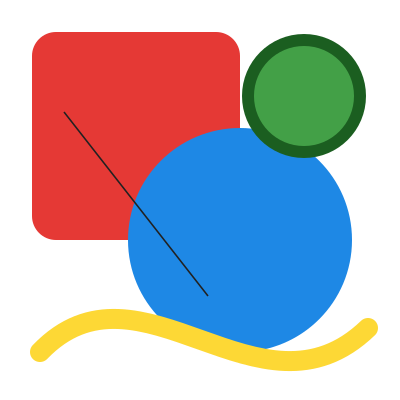

# tsembroidery

Read and write embroidery files, and turn SVG into stitches. Based on [pyembroidery](https://github.com/EmbroidePy/pyembroidery).

| Format | Machines                |
| ------ | ----------------------- |
| `.pes` | Brother, Babylock       |
| `.dst` | Tajima, most commercial |
| `.jef` | Janome, Elna            |
| `.exp` | Melco, Bernina          |
| `.vp3` | Husqvarna Viking, Pfaff |
| `.xxx` | Singer                  |

```sh
npm install @guillaumemmm/tsembroidery
```

```ts
import {
  readPes,
  readSvg,
  writePes,
  writeSvg,
} from "@guillaumemmm/tsembroidery";

const preview = writeSvg(readPes(pesBytes));

const { pattern, warnings } = readSvg(svgText, { size: 100 }); // fit the SVG in a 100 × 100 mm square
const pes = writePes(pattern);
```

<table>
  <tr>
    <td></td>
    <td></td>
  </tr>
  <tr>
    <td align="center">SVG input</td>
    <td align="center"><code>readSvg</code> output, drawn with <code>writeSvg</code></td>
  </tr>
</table>

## API

Coordinates in patterns are in **0.1 mm** (x to the right, y down). Lengths in the SVG settings are in **mm**.

| Function                                                           | Returns                 | Description                                                                       |
| ------------------------------------------------------------------ | ----------------------- | --------------------------------------------------------------------------------- |
| `readPes(bytes: Uint8Array)`                                       | `EmbPattern`            | Parses a `.pes` file.                                                             |
| `writePes(pattern: EmbPattern, settings?: PesWriteSettings)`       | `Uint8Array`            | Encodes a pattern as a `.pes` file.                                               |
| `readDst(bytes: Uint8Array)`                                       | `EmbPattern`            | Parses a Tajima `.dst` file.                                                      |
| `writeDst(pattern: EmbPattern, settings?: DstWriteSettings)`       | `Uint8Array`            | Encodes a pattern as a `.dst` file.                                               |
| `readJef(bytes: Uint8Array)`                                       | `EmbPattern`            | Parses a Janome `.jef` file.                                                      |
| `writeJef(pattern: EmbPattern, settings?: JefWriteSettings)`       | `Uint8Array`            | Encodes a pattern as a `.jef` file.                                               |
| `readExp(bytes: Uint8Array)`                                       | `EmbPattern`            | Parses a Melco `.exp` file.                                                       |
| `writeExp(pattern: EmbPattern, settings?: ExpWriteSettings)`       | `Uint8Array`            | Encodes a pattern as a `.exp` file.                                               |
| `readVp3(bytes: Uint8Array)`                                       | `EmbPattern`            | Parses a Husqvarna Viking / Pfaff `.vp3` file.                                    |
| `writeVp3(pattern: EmbPattern, settings?: Vp3WriteSettings)`       | `Uint8Array`            | Encodes a pattern as a `.vp3` file.                                               |
| `readXxx(bytes: Uint8Array)`                                       | `EmbPattern`            | Parses a Singer `.xxx` file.                                                      |
| `writeXxx(pattern: EmbPattern, settings?: XxxWriteSettings)`       | `Uint8Array`            | Encodes a pattern as a `.xxx` file.                                               |
| `readSvg(input: string \| Uint8Array, settings?: SvgReadSettings)` | `{ pattern, warnings }` | Turns SVG into stitches. `warnings` lists the parts of the SVG that were skipped. |
| `writeSvg(pattern: EmbPattern, settings?: SvgWriteSettings)`       | `string`                | Draws a pattern as SVG, one path per run of stitches.                             |
| `stitchZone(zone: StitchZone, settings?, from?)`                   | `Stitch[]`              | Stitches a thread's zone with new settings. See [Zones](#zones).                  |
| `resolveStitchSettings(settings?: Partial<ThreadStitchSettings>)`  | `ThreadStitchSettings`  | Checks stitch settings and fills in `readSvg`'s defaults.                         |
| `getThreadSet()` / `getJefThreadSet()`                             | `EmbThread[]`           | Brother (PES/PEC) and Janome (JEF) thread charts, fresh threads on every call.    |

`readSvg` needs a `DOMParser`. Browsers have one; in Node, pass one in the settings.

```ts
import { Window } from "happy-dom";

const { pattern } = readSvg(svgText, { DOMParser: new Window().DOMParser });
```

### `readSvg` `SvgReadSettings` settings

| Setting               | Default | Description                                                                                                                                                                                          |
| --------------------- | ------- | ---------------------------------------------------------------------------------------------------------------------------------------------------------------------------------------------------- |
| `size`                | `100`   | Edge in mm of the square the SVG's viewBox is fitted into. The stitches are then centered on (0, 0), where the needle starts.                                                                        |
| `runningStitchLength` | `2.5`   | Longest stitch along lines, in mm: thin strokes, the satin underlay and travel inside fills. Straight parts are split into equal stitches; corners and curves are kept, so the shape doesn't change. |
| `fillStitchLength`    | `3`     | Longest stitch in fill rows, in mm. Shorter is sturdier, longer is softer and faster to sew.                                                                                                         |
| `rowSpacing`          | `0.4`   | Gap between parallel stitches in fills and satin, in mm.                                                                                                                                             |
| `fillAngle`           | `45`    | Direction of fill rows in degrees: `0` is horizontal, `90` vertical, clockwise (y points down).                                                                                                      |
| `pullCompensation`    | `0`     | Fills and satin are widened by this much on each side, in mm, so seams stay closed when the fabric pulls in.                                                                                         |
| `fit`                 | `true`  | Shrink and move the stitches if needed so the design stays inside the `size` square (pull compensation, strokes on the edge and content outside the viewBox can overflow it).                        |
| `underlay`            | `true`  | Stitch a holding layer under fills and satin first.                                                                                                                                                  |
| `tieStitches`         | `0`     | Small back-and-forth stitches added wherever the thread is cut (start, end, both sides of jumps and color changes) so it holds. `2` or more locks the start too.                                     |
| `minStitchLength`     | `0`     | Shortest stitch along lines, travel and inside fill rows, in mm (about `0.3` avoids thread breaks). Closer needle points merge into the next stitch; line and row ends stay exact, satin is untouched.|
| `colorTolerance`      | `10`    | Colors closer than this (0–765) share one thread. `0` keeps every distinct color.                                                                                                                    |
| `flattenTolerance`    | `0.05`  | Maximum error when curves are turned into lines, in mm.                                                                                                                                              |

#### Thread records

Each thread records, in `thread.extras.svg`, the `kinds` of stitches it holds (`"fill"`, `"satin"`, `"running"`).

Every `threadlist` entry has its own thread object: a color stitched again after other colors (thin lines come last) gets a copy of its thread, with its own record.

### Zones

A zone is what a thread covers, as plain data in pattern units (0.1 mm), so it can go to a web worker:

```ts
type ZonePart =
  | { kind: "fill"; rings: { x: number; y: number }[][] }
  | {
      kind: "satin";
      points: { x: number; y: number }[];
      closed: boolean;
      width: number;
    }
  | { kind: "running"; points: { x: number; y: number }[]; closed: boolean };
type StitchZone = ZonePart[];
```

### App data

`pattern.extras` and `thread.extras` hold data apps attach by key; readers also put file metadata (name, author…) in `pattern.extras`. Thread extras are kept in memory only: no reader fills them and no writer saves them. A thread object can be in several patterns, which then share its extras. Type your own keys with module augmentation:

```ts
declare module "@guillaumemmm/tsembroidery" {
  interface ThreadExtras {
    myApp?: { locked: boolean };
  }
  interface PatternExtras {
    myApp?: { version: number };
  }
}
```

### Writing settings

Every writer takes `encode` (`true` by default: split moves too long for the format first) and the encoder settings.

- `writePes` takes `version`: `6` by default, which keeps exact thread colors and metadata, or `1`.
- `writeDst` takes `extendedHeader` (`false` by default): DST stores no thread colors, so the machine just stops between colors, unless the extended header lists them.
- `writeJef` takes `trims` (`false` by default: Janome machines trim on long jumps; `true` writes trim commands), `trimAt` (commands per trim, `3`) and `date` (`YYYYMMDDHHMMSS`, now by default). JEF stores Janome thread chart indexes, so colors become the nearest Janome threads.
- EXP stores no thread colors; VP3 and XXX keep exact colors.

## License

MIT
